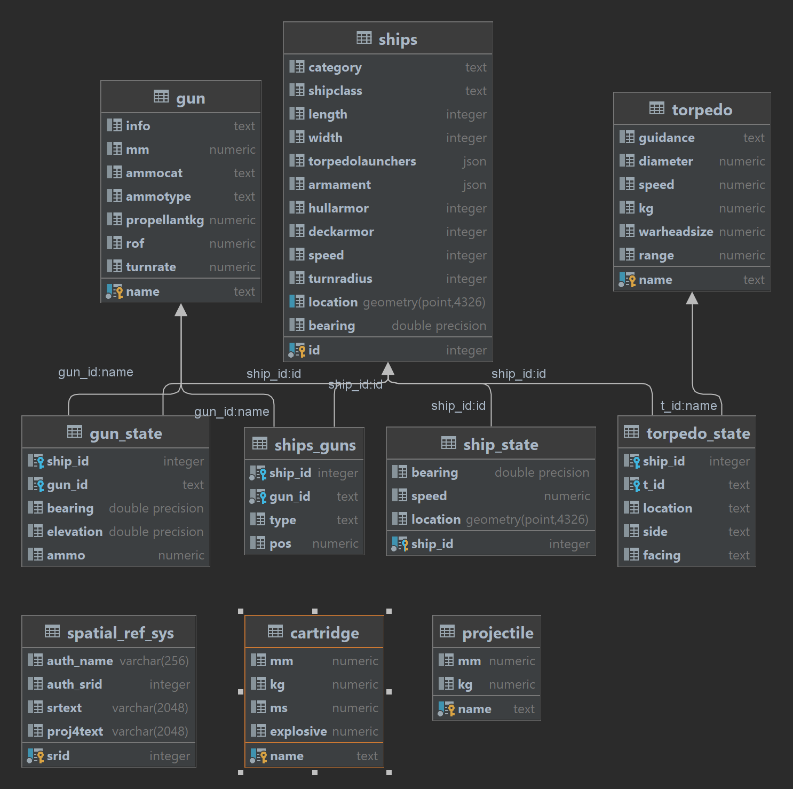

## P04.2 - BS: Database Creation

### Description:

This project creates all necessary tables for this game as well as setting some basic reusable. Also there is a schema of the database.

### Files

|   #   | File/folder              | Description                                                         |
| :---: | ------------------------ | ------------------------------------------------------------------- |
|   1   | main.py                  | inserts the data into the tables 
|   2   | SampleQueries.py         | Runs basic queries and outputs the results into Query_Results file  |
|   3   | SQL/Tables               |consits the files that are used to create the tables                 |
|   4  | Query_Results.txt        | This file outputs the data that is produced from the sql queries    |

## schema

